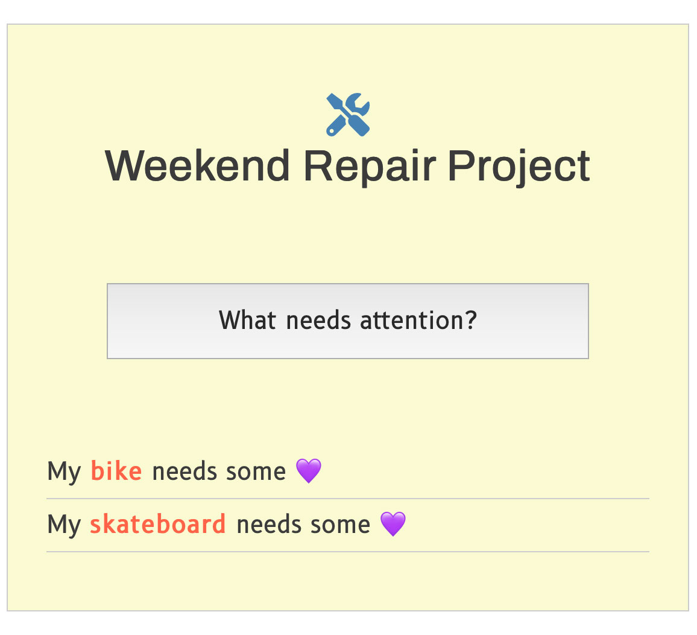

<h1>Weekend Repair Project</h1>

Program uses factory functions to loop through what projects need repair.

<h4>JavaScript Toolbox:</h4>

* Function Expressions
* Disabled Property
* Event Handlers
* Boolean Values
* Event Listeners
* querySelectorAll()
* Add objects
* Empty array 
* for…of loop
* if statement
* push() 
* innerHTML
* createElement
* append()
* Looping through arrays 

JavaScript program has main object with several objects to loop over, logging them out to the console.

